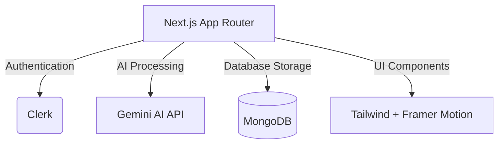

<div align="center">
  <a href="https://github.com/soumyadip9mondal/PolicyPilot">
    
  </a>

  <br>

  <p align="center">
    <b>Empowering individuals to understand, navigate, and apply for policies seamlessly through AI.</b>
  </p>

  <br>

  <!-- Animated Badges -->
  <a href="https://nextjs.org/">
    
  </a>
  <a href="https://reactjs.org/">
    
  </a>
  <a href="https://tailwindcss.com/">
    
  </a>
  <a href="https://www.typescriptlang.org/">
    
  </a>
  <a href="https://www.mongodb.com/">
    
  </a>
  <a href="https://clerk.com/">
    
  </a>

  <br><br>

  [🟢 Live Demo](#) •
  [📑 Documentation](#) •
  [🐛 Report Bug](#) •
  [✨ Request Feature](#)
</div>

---

## 🌟 Features

<div align="center">
  
</div>

<br>

### 🤖 AI-Powered Analysis
Understand complex policies and hidden clauses in seconds. Our integrated AI reads through legal jargon and simplifies it for you.

### 🎯 Instant Eligibility Checks
Upload your profile and dynamically match with government and private schemes you didn't even know you were eligible for.

### 📝 Auto-Fill Applications
Tired of repetitive forms? PolicyPilot extracts your data securely and auto-fills application forms across multiple portals.

### 💬 Conversational Policy Assistant
Chat directly with our AI to ask contextual questions about specific schemes, deadlines, and required documents.

<br>

---


## 🛠️ Installation & Setup

Want to run PolicyPilot locally? Follow these simple steps:

**1. Clone the repository**
```bash
git clone https://github.com/soumyadip9mondal/PolicyPilot.git
cd PolicyPilot
```

**2. Install dependencies**
```bash
pnpm install
```

**3. Set up environment variables**
Copy the sample `.env` file and add your actual API keys:
```bash
cp .env.example .env.local
```
*(Required: Clerk Keys, MongoDB URI, Gemini API Key)*

**4. Start the development server**
```bash
pnpm run dev
```
Open [http://localhost:3000](http://localhost:3000) to view the app.

<br clear="both">

---

## 🏗️ Architecture



---

## 🎨 UI Showcase

<p align="center">
  
  
  
</p>

Designed with modern glassmorphism, smooth micro-interactions, and high-contrast accessibility in mind. The app adapts flawlessly from desktop to mobile screens.

---

## 🤝 Contributing

Contributions, issues, and feature requests are welcome!<br>
Feel free to check [issues page](#).

1. Fork the Project
2. Create your Feature Branch (`git checkout -b feature/AmazingFeature`)
3. Commit your Changes (`git commit -m 'Add some AmazingFeature'`)
4. Push to the Branch (`git push origin feature/AmazingFeature`)
5. Open a Pull Request

---

## 📄 License

Distributed under the MIT License. See `LICENSE` for more information.

---

<div align="center">
  
</div>
